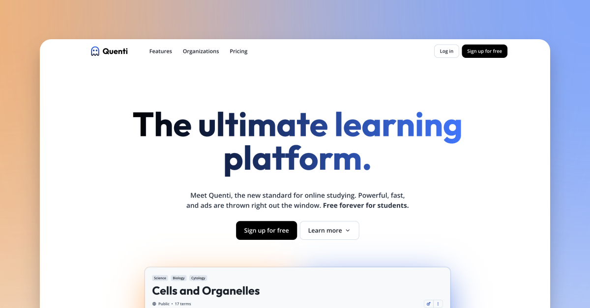

[](https://fergeh.io)

The open-source Quizlet alternative.

## The Stack

- [Next.js](https://nextjs.org)
- [tRPC](https://trpc.io)
- [NextAuth](https://next-auth.js.org)
- [Prisma](https://prisma.io)
- [Chakra UI](https://chakra-ui.com)
- [MySQL](http://mysql.org/)
- [Zustand](https://github.com/pmndrs/zustand)
- [ClickHouse](https://clickhouse.tech/)

## Running Locally

Get up and running by following these steps.

### Prerequisites

- Node.js 18.x
- MySQL
- Bun
- Docker and docker-compose _(recommended)_

### Setup

1. Clone the repo

   ```sh
   git clone https://github.com/fergeh-io/fergeh
   ```

2. Go to the project folder

   ```sh
   cd fergeh
   ```

3. Install dependencies with bun

   ```sh
   bun i
   ```

4. Set up the `.env` file

   - Copy `.env.example` to `.env`
   - Use `openssl rand -base64 32` to generate a key for `NEXTAUTH_SECRET` and set it as the value in `.env`
   - Use `openssl rand -base64 24` to generate a key for `FERGEH_ENCRYPTION_KEY` and set it as the value in `.env`
   - You'll need to create a Google OAuth client ID from the [Google API Console](https://console.developers.google.com/). There are plenty of guides for this, like [this one from LogRocket](https://blog.logrocket.com/nextauth-js-for-next-js-client-side-authentication/#create-a-google-oauth-app) embedded:

     > 
     >
     > Navigate to Credentials and click on Create credentials, and then OAuth client ID. You will be asked to fill in the following:
     >
     > **Choose an Application Type**: Select Web Application
     >
     > **Name**: This is the name of your application
     >
     > **Authorized JavaScript origins**: This is the full URL to the homepage of our app. Since we are still in development mode, we are going to fill in the full URL our development server is running on. In this case, it is `http://localhost:3000`
     >
     > **Authorized redirect URIs**: Users will be redirected to this path after they have authenticated with Google: `http://localhost:3000/api/auth/callback/google`

     Copy your client ID and secret created and fill in the `GOOGLE_CLIENT_ID` and `GOOGLE_CLIENT_SECRET` values in `.env`

     

5. Start up a local MySQL database with

   ```sh
   docker-compose -f docker-compose.mysql.yml up
   ```

6. Push schema changes and generate the Prisma client
   ```sh
   bun prisma db:push
   ```

### Running

Start a development server with

```sh
bun dev
```

or create and start a production build with

```
bun run build
bun start
```

Navigate to http://localhost:3000 and Fergeh should be up and running!
